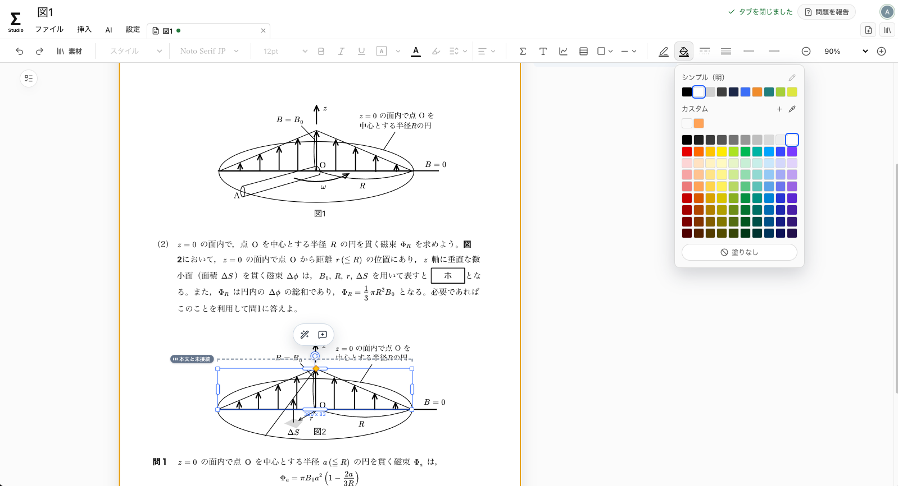

<p align="center">
  
</p>

<h1 align="center">Sigma Studio</h1>

<p align="center">
  <strong>数式・図形・グラフ、全部ひとつ。</strong><br />
  すべての時間を、考える時間に。
</p>

<p align="center">
  理系教材を作成する、オープンソースのエディタ。<br />
  本文を書き、図を添え、AIと考える。仕上げた教材は、そのままPDFへ。
</p>

<p align="center">
  <a href="https://github.com/Atsu-Taiyo/SIGMA-Studio/releases/latest"></a>
  <a href="https://chocoschools.com/sigma-studio/#try"></a>
</p>

<p align="center">
  <a href="#features">機能を見る</a> ·
  <a href="https://github.com/Atsu-Taiyo/SIGMA-Studio/issues/new/choose">不具合報告・やりたいこと</a> ·
  <a href="CONTRIBUTING.md">開発に参加する</a> ·
  <a href="LICENSE">MIT License</a>
</p>

<a name="features"></a>

## 教材づくりを、ひとつの画面で

文章と数式だけでなく、図形・グラフ・表・画像も同じ教材の中へ。ページ形式のプリントにも、自由に考えを広げるホワイトボードにも対応しています。

<p align="center">
  <a href="docs/images/editor-canvas.png"></a>
  <br />
  <sub>本文と図を行き来しながら編集。画像をクリックすると拡大できます。</sub>
</p>

| 書く・組み立てる | 描く・伝える | AIと進める |
| :--- | :--- | :--- |
| 数式を含む本文を編集。ページ形式とホワイトボードを使い分けられます。 | 図形・グラフ・表・画像を配置。仕上がった教材をPDFで出力できます。 | AIの編集提案とローカルMCP連携で、教材づくりを進められます。 |

AI機能は、利用するプロバイダの接続設定が必要です。

## はじめる

**アプリを使う** — [最新リリース](https://github.com/Atsu-Taiyo/SIGMA-Studio/releases/latest)から、お使いのmacOS / Windowsに対応するアプリをダウンロードしてください。

**まず触ってみる** — [公式サイトのデモ](https://chocoschools.com/sigma-studio/#try)で、編集画面を試せます。

**手元の素材を使う** — JSON・TeX・PowerPointのインポートに対応しています。文書はSigmaDoc JSONで保存します。

## あなたのアプリにも、Sigma Studioを

React向けのEditor・Viewerを公開しています。編集機能や教材の表示を、別のアプリにも組み込めます。

| パッケージ | 用途 | ドキュメント |
| :--- | :--- | :--- |
| **Editor** | 教材を編集する | [Editor README](packages/editor/README.md) |
| **Viewer** | 教材を表示する | [Viewer README](packages/viewer/README.md) |

ホスト側の状態管理や組み込み方は、[組み込みガイド](docs/embedding-guide.md)を参照してください。

<details>
<summary><strong>ローカルで開発する</strong> — セットアップと関連ドキュメント</summary>

Node.js 24とnpmを使います。リポジトリのルートで実行してください。

```sh
npm ci
npm run dev
```

Electronアプリの開発起動は `npm run electron:dev` です。

- [開発・検証手順](CONTRIBUTING.md)
- [アーキテクチャ](docs/architecture.md)
- [組み込みガイド](docs/embedding-guide.md)

文書の正本はSigmaDoc JSONです。

</details>

## 一緒に育てていく

「ここがうまく動かない」「こんなことができたらうれしい」。どちらも[Issue作成画面](https://github.com/Atsu-Taiyo/SIGMA-Studio/issues/new/choose)からお寄せください。「不具合報告」または「機能リクエスト」を選ぶと、フォームに沿って記入できます。GitHubアカウントが必要です。

投稿内容と添付ファイルは公開されます。教材や画像を添付する際は、生徒名などの個人情報を取り除いてください。コードの変更を提案する際は、再現手順と実行した検証を添えてください。

<p align="center">
  <strong>Sigma Studioが役に立ったら、GitHubのStarで応援してください。</strong><br />
  日々のフィードバックと応援が、開発を続ける励みになります。<br /><br />
  <a href="https://github.com/Atsu-Taiyo/SIGMA-Studio">☆ GitHubでStarを付ける</a>
</p>

## Supported by

<p align="center">
  <a href="https://sss-education.jp/"></a>
</p>

<p align="center">
  Sigma Studioは、<a href="https://sss-education.jp/"><strong>SSS Education</strong></a>の支援を受けて開発しています。<br />
  開発を支えていただき、ありがとうございます。
</p>

## ライセンス

[MIT License](LICENSE)。同梱する第三者コンポーネントのライセンスも適用されます。掲載素材については[画像の出典](docs/images/README.md)を参照してください。
