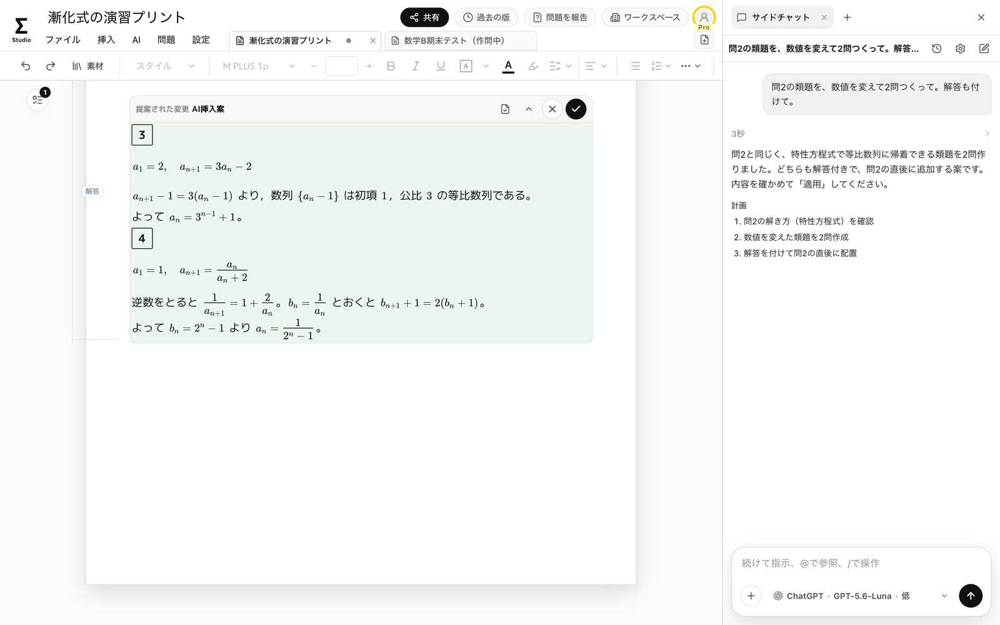
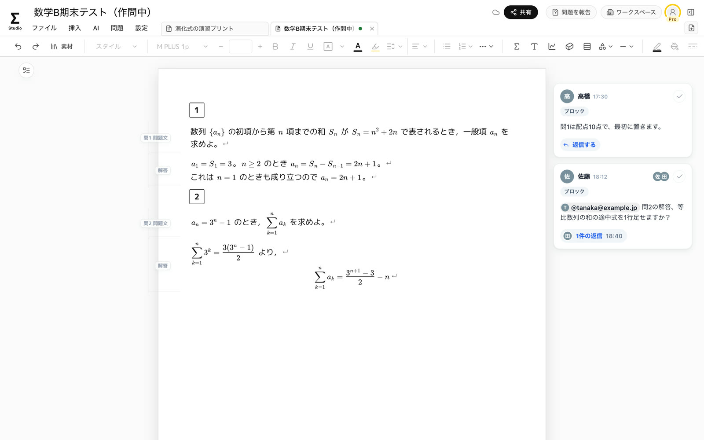
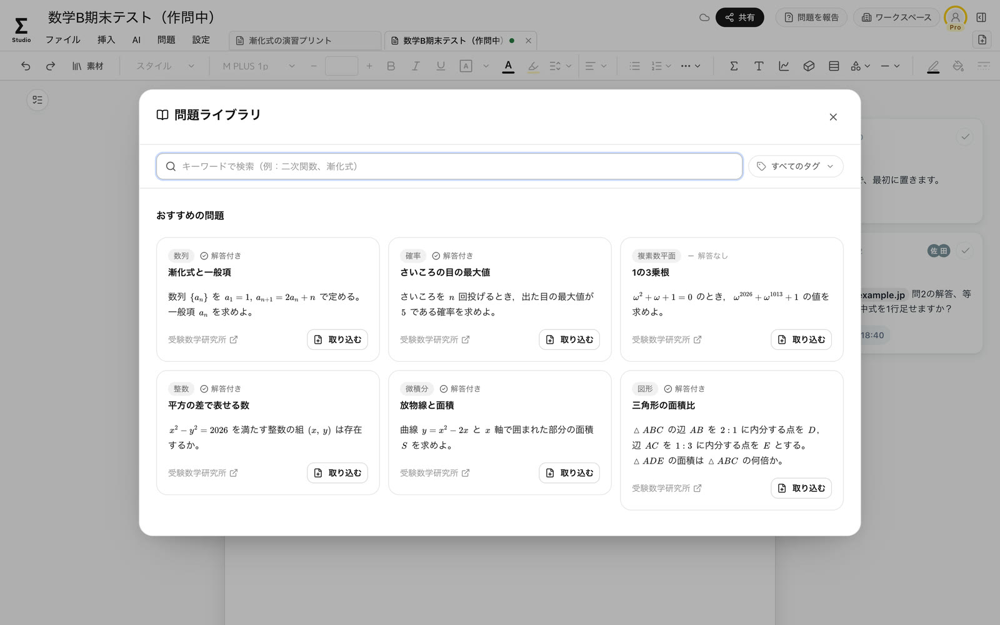
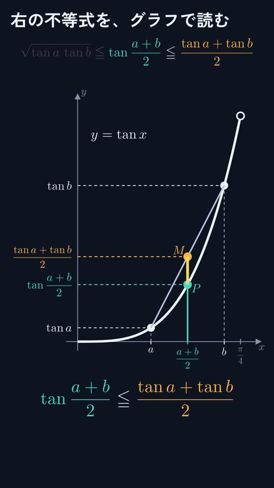
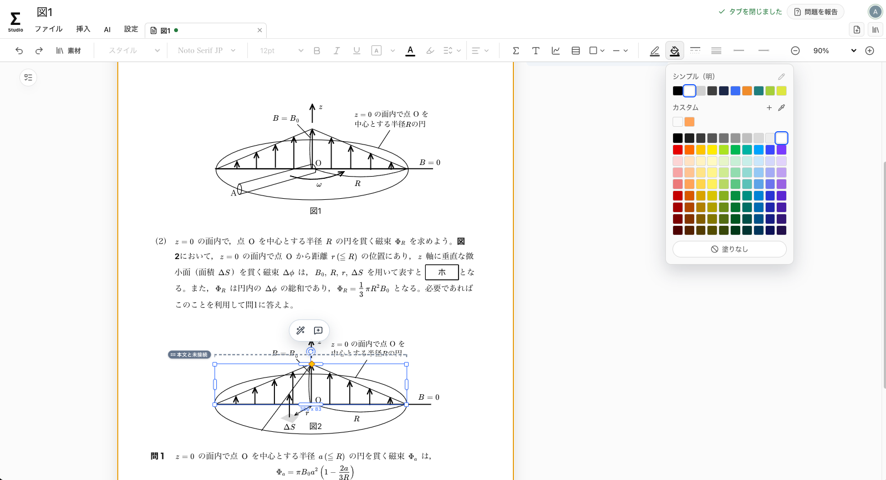

<p align="center">
  <a href="https://chocoschools.com/sigma-studio/"></a>
</p>

<h1 align="center">Sigma Studio</h1>

<p align="center">
  <strong>数式・図形・グラフ、全部ひとつ。</strong><br />
  すべての時間を、考える時間に。
</p>

<p align="center">
  理系教材を作成する、オープンソースのエディタ。<br />
  AIに編集案を出させ、仲間と同じ教材を仕上げ、良問は解答ごと取り込む。
</p>

<p align="center">
  <a href="https://apps.microsoft.com/detail/9PLZ8T3XVQM1?mode=direct"></a>
  <a href="https://github.com/Atsu-Taiyo/SIGMA-Studio/releases/latest"></a>
  <a href="https://chocoschools.com/sigma-studio/#try"></a>
</p>

<p align="center">
  <a href="https://github.com/Atsu-Taiyo/SIGMA-Studio/releases/latest"></a>
  
  <a href="LICENSE"></a>
  <a href="https://discord.gg/BsbcBQXbT"></a>
</p>

<p align="center">
  <a href="#ai">AI</a> ·
  <a href="#collaboration">共同編集</a> ·
  <a href="#problem-library">問題ライブラリ</a> ·
  <a href="#video">動画生成（開発中）</a> ·
  <a href="#getting-started">はじめる</a> ·
  <a href="https://discord.gg/BsbcBQXbT">Discord</a> ·
  <a href="https://chocoschools.com/sigma-studio/">公式サイト</a>
</p>

<a name="ai"></a>

## 01 · AIに、任せ切らない。

ChatGPT はサブスクの範囲でアプリ内に。頼んだ編集は「編集案」として届き、確かめてから取り込む。教材の外へコピペする往復は、もうしない。

<p align="center">
  <a href="docs/images/screen-ai.jpg"></a>
  <br />
  <sub>「問2の類題を2問、解答付きで」と頼んだところ。変更は「AI挿入案」として届き、適用するまで教材は変わりません。</sub>
</p>

- **ChatGPT（Codex）・Claude Code・Gemini** を、契約中のプランのままアプリの中で使えます。
- **外のAIからも編集できる** — ローカルMCPを公開しているので、手元の Claude Code・Codex・Gemini から教材を直接作成・修正できます。[MCP連携](docs/mcp-local-app.md)
- **教材は運営者を経由しない** — AIとのやりとりは、選んだAIサービスへ直接届きます。

AI機能は、利用するプロバイダの接続設定が必要です。

<a name="collaboration"></a>

## 02 · 教材を、みんなで。

招待リンクを送るだけで、同じ教材を一緒に編集。コメントで @メンションして、作問・校正・解答チェックを分担する。通信が切れても編集は止まらず、つながれば同期する。

<p align="center">
  <a href="docs/images/screen-collab.jpg"></a>
  <br />
  <sub>問題ごとにコメントのスレッド。@メンションした相手に届きます。</sub>
</p>

- **招待リンクで共有** — 権限は管理者・編集者・閲覧者から人ごとに選べます。
- **招待された人は無料** — 無料プランでも、1つの教材を1人と共有できます。フォルダごとの共有や大人数での共有はProで。

[共同編集の使い方](docs/collaboration-user-guide.md) · [プランの説明](docs/sharing-plans.md)

<a name="problem-library"></a>

## 03 · 良問を、解答ごと。

大学受験数学の良問を投稿・評価・共有する[りずりーの受験数学研究所](https://jukenmath.net/)と連携。気になった問題を、解答付きのまま教材に取り込む。AIに「整数の良問を5問」と頼んで集めることもできます。

<p align="center">
  <a href="docs/images/screen-library.jpg"></a>
  <br />
  <sub>分野タグとキーワードで探し、「取り込む」で問題と公式解答を新しい教材として開きます。</sub>
</p>

問題ライブラリの利用にはSigma Studioへのログインが必要です。取り込んだ問題には出典が残ります。[連携の仕組み](docs/problem-solution-integration.md)

<a name="video"></a>

## 04 · 教材から、解説動画まで（開発中）

次は動画です。Sigma Studioの問題から、図が動き、声で解説する縦型の動画をつくれるようにします。

<p align="center">
  <a href="https://x.com/chocoschools/status/2108427182402113723"></a><br />
  <sub>サンプル：tan の不等式をグラフで読む解説動画（画像を押すとXで再生できます）</sub>
</p>

1. **問題を選ぶ** — 教材や問題ライブラリから。
2. **台本と動きを組む** — 解き方の流れに沿って、図と数式が動く構成をAIが下書き。
3. **声を付けて書き出す** — ナレーション付きの縦型動画に。

公開は[X（@chocoschools）](https://x.com/chocoschools)と[Discord](https://discord.gg/BsbcBQXbT)でお知らせします。

## 数式・図形・グラフ、全部ひとつ

文章と数式だけでなく、図形・グラフ・表・画像も同じ教材の中へ。ページ形式のプリントにも、自由に考えを広げるホワイトボードにも対応しています。

<p align="center">
  <a href="docs/images/editor-canvas.png"></a>
  <br />
  <sub>本文と図を行き来しながら編集。画像をクリックすると拡大できます。</sub>
</p>

| 数式は、文章の流れのまま | 図形・グラフは、あとから直せる | 問題と解答を、構造で持つ |
| :--- | :--- | :--- |
| インラインもディスプレイも、TeXの正確さで。 | 画像で固めず、編集できるオブジェクトのまま残ります。 | 問題・解答・解説を同じ文書に。教師版・生徒版を見据えた作りです。 |
| **手元の資料を取り込む** | **教材は、あなたの端末に** | **オープンソース** |
| JSON・TeX・PowerPointから教材へ。仕上げた教材はPDFに書き出せます。 | 普段の教材は端末内に保存。運営者が内容を取得・閲覧することはできません。 | MITライセンスで、ソースコードをこのリポジトリに公開しています。 |

<a name="getting-started"></a>

## はじめる

| | 入手先 |
| :--- | :--- |
| **Windows** | [Microsoft Store](https://apps.microsoft.com/detail/9PLZ8T3XVQM1)から入手できます。アップデートもストアから届きます。 |
| **macOS** | [最新リリース](https://github.com/Atsu-Taiyo/SIGMA-Studio/releases/latest)から、Apple Silicon / Intel に対応する `.dmg` をダウンロードしてください。 |
| **ブラウザ** | [公式サイトのデモ](https://chocoschools.com/sigma-studio/#try)で、デスクトップ版と同じ編集画面を試せます（編集内容は保存されません）。 |

**手元の素材を使う** — JSON・TeX・PowerPointのインポートに対応しています。文書はSigmaDoc JSONで保存します。

**教材ファイルを開く** — `.sigma` をSigma Studioで開けます。以前の `.sigma.json` / `.sigmadoc.json` も読み込めます。[開き方と保存先](docs/opening-material-files.md)

## あなたのアプリにも、Sigma Studioを

React向けのEditor・Viewerを公開しています。編集機能や教材の表示を、別のアプリにも組み込めます。

| パッケージ | 用途 | ドキュメント |
| :--- | :--- | :--- |
| **Editor** | 教材を編集する | [Editor README](packages/editor/README.md) |
| **Viewer** | 教材を表示する | [Viewer README](packages/viewer/README.md) |

ホスト側の状態管理や組み込み方は、[組み込みガイド](docs/embedding-guide.md)を参照してください。

<details>
<summary><strong>ローカルで開発する</strong> — セットアップと関連ドキュメント</summary>

Node.js 24とnpmを使います。リポジトリのルートで実行してください。

```sh
npm ci
npm run dev
```

Electronアプリの開発起動は `npm run electron:dev` です。

- [開発・検証手順](CONTRIBUTING.md)
- [アーキテクチャ](docs/architecture.md)
- [組み込みガイド](docs/embedding-guide.md)

文書の正本はSigmaDoc JSONです。

</details>

## 一緒に育てていく

使い方の相談、ほしい機能、作った教材の話は [Discord](https://discord.gg/BsbcBQXbT) へどうぞ。開発者もいます。

「ここがうまく動かない」「こんなことができたらうれしい」。どちらも[Issue作成画面](https://github.com/Atsu-Taiyo/SIGMA-Studio/issues/new/choose)からお寄せください。「不具合報告」または「機能リクエスト」を選ぶと、フォームに沿って記入できます。GitHubアカウントが必要です。

投稿内容と添付ファイルは公開されます。教材や画像を添付する際は、生徒名などの個人情報を取り除いてください。コードの変更を提案する際は、再現手順と実行した検証を添えてください。

<p align="center">
  <strong>Sigma Studioが役に立ったら、GitHubのStarで応援してください。</strong><br />
  日々のフィードバックと応援が、開発を続ける励みになります。<br /><br />
  <a href="https://github.com/Atsu-Taiyo/SIGMA-Studio">☆ GitHubでStarを付ける</a>
</p>

## Supported by

<p align="center">
  <a href="https://sss-education.jp/"></a>
</p>

<p align="center">
  Sigma Studioは、<a href="https://sss-education.jp/"><strong>SSS Education</strong></a>の支援を受けて開発しています。<br />
  開発を支えていただき、ありがとうございます。
</p>

## ライセンス

[MIT License](LICENSE)。同梱する第三者コンポーネントのライセンスも適用されます。掲載素材については[画像の出典](docs/images/README.md)を参照してください。
